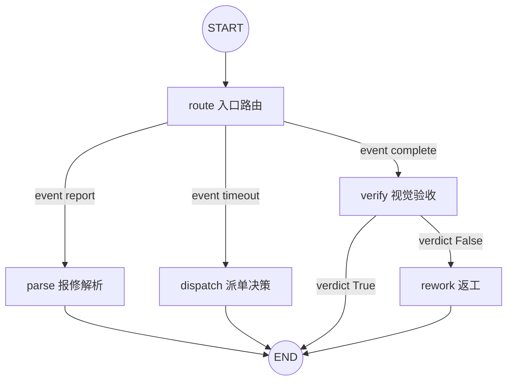
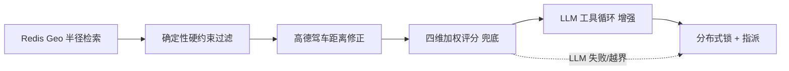
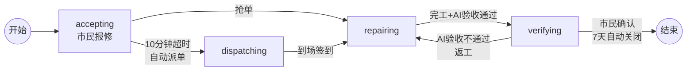

# 城智连响 —— 城市公共设施智能报修与派单系统

> 一个面向「市民报修 → AI 解析 → 智能派单 → 到场维修 → AI 验收 → 结算闭环」全链路的人工智能应用开发实战项目。
>
> 技术栈：FastAPI + SQLAlchemy(异步) + MySQL / Redis / MongoDB / Elasticsearch / RabbitMQ + LangChain + LangGraph + 阿里云百炼(qwen-vl-max) + 高德地图 API。

## 🚀 在线演示

| 端 | 地址 | 账号 / 密码 |
| --- | --- | --- |
| 🖥️ 管理后台 | http://120.26.130.186/admin/ | admin / admin123 |
| 📱 市民端 | http://120.26.130.186/ | zhangsan / 123456 |
| 🔧 维修员端 | http://120.26.130.186/worker/ | worker1 / 123456 |

---

## 1. 项目背景

传统城市公共设施的报修高度依赖人工：市民电话报修、话务员手工记录、调度员凭经验派单、维修员到场靠口头反馈。本系统将 AI 能力嵌入三个关键决策点——**报修解析、派单决策、视觉验收**，并围绕「最小运维总成本」目标构建了一套可落地、可降级的智能派单链路。

- **信息割裂** → 市民、维修员、管理员三端信息实时同步；
- **派单依赖经验** → 硬约束 + 四维加权 + LLM 工具循环的量化派单；
- **验收靠人工核验** → qwen-vl-max 视觉模型自动对比维修前后照片。

## 2. 总体架构：四库分层 + 消息驱动

核心思想：**MySQL 是唯一同步阻断点（事务性事实源），其余写入全部异步化、可容错**。

```
                 ┌─────────────────────────────────────────────┐
                 │                FastAPI 应用层                 │
                 │  /api/v1/citizen · /api/v1/worker · /api/v1/admin │
                 └───────┬───────────────────────────┬──────────┘
                         │                           │
          ┌──────────────▼──────────────┐   ┌────────▼─────────────────┐
          │        LangGraph 决策链       │   │    RabbitMQ 消费者(后台)  │
          │  route → parse/dispatch/verify│   │  dispatch / timeout /     │
          │        → rework (短图)        │   │  es_sync(重试+DLQ)        │
          └───────┬──────────────────────┘   └────────┬─────────────────┘
                  │                                     │
   ┌──────────────┼──────────────┬───────────────┬──────┴──────────────┐
   ▼              ▼              ▼               ▼                      ▼
 MySQL        Redis          MongoDB        Elasticsearch          RabbitMQ
 事务事实源    缓存/Geo/锁/计数  文档/日志        搜索索引              消息总线
```

| 存储 | 定位 | 承载数据 |
| --- | --- | --- |
| **MySQL** | 事务性事实源（唯一同步阻断点） | `tickets` 工单主表、`workers` 维修员档案、`settlements` 结算单、`audit_rules` 结算规则 |
| **Redis** | 高并发读 + 原子操作（拆 4 个逻辑库） | DB0 热状态缓存、DB1 Geo 派单、DB2 分布式锁、DB3 实时计数器 |
| **MongoDB** | 灵活文档 + 过程日志 | AI 分析日志、维修记录、图片元数据、通知、审计 |
| **Elasticsearch** | 全文检索 + 绩效聚合 | 工单检索、维修员绩效索引 |
| **RabbitMQ** | 异步解耦 + 延迟调度 | 派单、超时延迟队列、ES 同步（重试 + DLQ）、差评复核 |

## 3. AI 决策链：LangGraph 事件驱动短图

采用**事件驱动短图**而非长驻状态机：每个业务事件触发一次 `ainvoke(event=...)`，图在秒级内跑完即退出；工单生命周期状态存 MySQL，RabbitMQ 延迟队列负责「唤醒」下一次图执行（无 checkpointer）。



| 业务事件 | 触发位置 | 图入口 | 节点链路 |
| --- | --- | --- | --- |
| 市民报修 | `report_service.submit_repair_report` | `event=report` | route → parse |
| 10 分钟超时 | `main.handle_timeout`（RabbitMQ 消费者） | `event=timeout` | route → dispatch |
| 维修员完工 | `repair_service.worker_complete` | `event=complete` | route → verify（→ rework） |

**设计约定**：LangGraph 节点 = AI 决策点；工具调用、硬约束、评分算法、降级回退都是节点内部的实现细节，不提升为独立节点。

## 4. 三大 AI 决策点

| 决策点 | 模型/实现 | 输出 | 降级策略 |
| --- | --- | --- | --- |
| **parse 报修解析** | LangChain `with_structured_output` + Pydantic 约束 | 类别 / 子类 / 紧急度 / 置信度 | 关键词匹配 mock 知识库（7 类标准维修知识，降级不降质量） |
| **dispatch 派单决策** | 三层漏斗 + LLM 工具循环（`bind_tools`） | 选定维修员 + 评分明细 | 确定性四维加权算法兜底 |
| **verify 视觉验收** | `qwen-vl-max` 前后照片对比 | 通过与否 / 置信度 / 差异摘要 | 默认通过（confidence=0.75），保证链路不卡死 |

## 5. 派单决策：硬约束 + 四维加权 + LLM 工具循环（核心亮点）



1. **Redis Geo 半径检索**：普通工单 5km、紧急工单 10km，最多 20 个候选；
2. **确定性硬约束**（LLM 无法绕过）：日单上限 / 夜班值守(22:00–06:00) / 技能匹配，紧急工单空池时放宽重试；
3. **两段式距离**：Geo 直线粗筛 → 高德驾车精修（5 分钟缓存），高德失败回退直线距离；
4. **四维加权评分**（确定性兜底）：距离 40% / 负载 30% / 好评 20% / 响应速度 10%；
5. **LLM 工具循环**（可选增强）：模型自主调用 `search_candidates` / `get_worker_profile` / `get_driving_distance` / `submit_dispatch` 四个工具（最多 4 轮），最终选择必须落在硬约束过滤后的合法候选池内，越界即回退确定性算法；
6. **指派**：Redis SETNX 分布式锁 + MySQL 乐观锁双保险。

> 一句话总结：**硬约束是确定性的「地板」，四维加权是确定性的「兜底」，LLM 工具循环是「天花板」**——LLM 只被允许在硬约束划定的安全边界内做更聪明的排序。

## 6. 工单状态机



六个时间戳（`created_at / accepted_at / dispatched_at / started_at / completed_at / closed_at`）完整刻画工单全生命周期，支撑响应速度（增量平均算法）、履约时效等指标。

## 7. 可靠性工程：全链路降级矩阵

| 依赖 | 故障时行为 |
| --- | --- |
| LLM（百炼） | NLP/验收走 mock 知识库；派单走确定性四维算法 |
| 高德驾车 API | 回退 Redis Geo 直线距离 / Haversine |
| Redis Geo | 返回空候选，报「半径内无在岗维修员」 |
| MongoDB | 日志/审计写失败仅 warning，不影响主流程 |
| ES / RabbitMQ | 工单已受理，ES 下次全量同步补回（重试 + 指数退避 + DLQ） |
| MySQL | 唯一同步阻断点，失败即回滚并返回错误 |

## 8. 项目结构

```
city_repair_system/
├── backend/
│   ├── app/
│   │   ├── api/            # FastAPI 路由（citizen / worker / admin）
│   │   ├── agent/          # LangGraph 决策链（graph / nodes / state）
│   │   ├── config/         # 四库连接与配置
│   │   ├── models/         # SQLAlchemy ORM 模型
│   │   ├── services/       # 业务服务（报修 / 派单 / 维修 / 结算 / 高德 / 阿里云）
│   │   └── mq/             # RabbitMQ 消费者（派单 / 超时 / ES 同步）
│   ├── scripts/            # 初始化与种子数据脚本
│   └── tests/
├── frontend/
│   ├── citizen-app/        # 市民端（Vue 3）
│   ├── worker-h5/          # 维修员移动端 H5（Vue 3）
│   └── admin-pc/           # 市政管理 PC 后台（Vue 3 + Element Plus）
├── docker-compose.yml      # 基础设施编排
├── docker-compose.lite.yml # 精简版编排
├── docker-compose.prod.yml # 生产环境编排
├── DEPLOY.md               # 部署上线指南
└── docs/                   # API 文档与数据模型
```

## 9. 快速启动

```bash
# 1. 配置环境变量
cd backend && cp .env.example .env   # 按需填写数据库密码与 LLM/高德 Key

# 2. 启动基础设施（MySQL / Redis / MongoDB / ES / RabbitMQ）
docker-compose up -d

# 3. 安装依赖并启动后端（自动建表 + 自动补齐新增列）
pip install -r requirements.txt && python run.py

# 4. 启动前端（三端分别启动）
cd frontend/citizen-app && npm install && npm run dev
cd frontend/worker-h5   && npm install && npm run dev
cd frontend/admin-pc    && npm install && npm run dev
```

> 生产环境部署见 [DEPLOY.md](DEPLOY.md)。

## 10. 项目边界

- 纳入范围：四库分层存储、三端前端、LangGraph 三大 AI 决策点、RabbitMQ 异步队列、AI 验收返工闭环、结算规则引擎
- 明确排除：IoT 设备对接、AI 预测性运维、政务财务系统对接、原生 APP 开发
