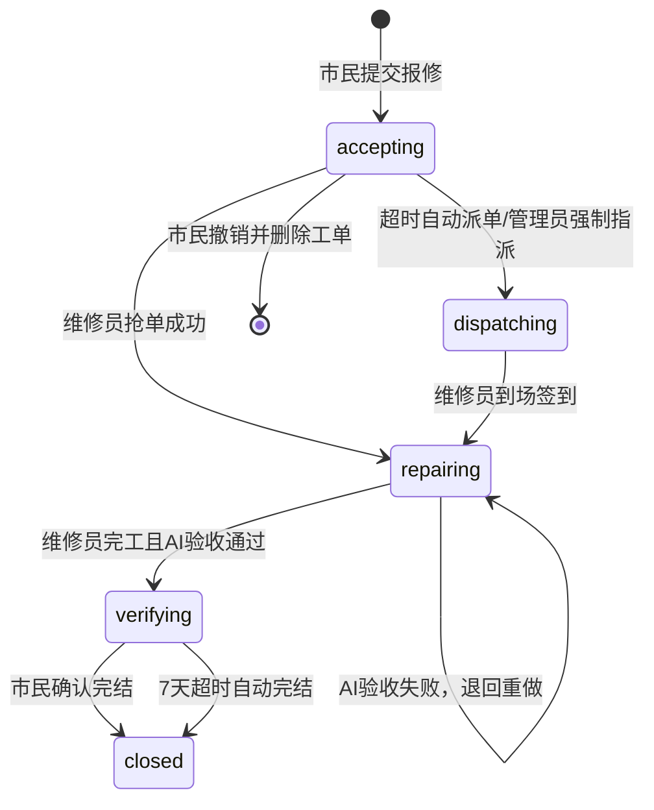
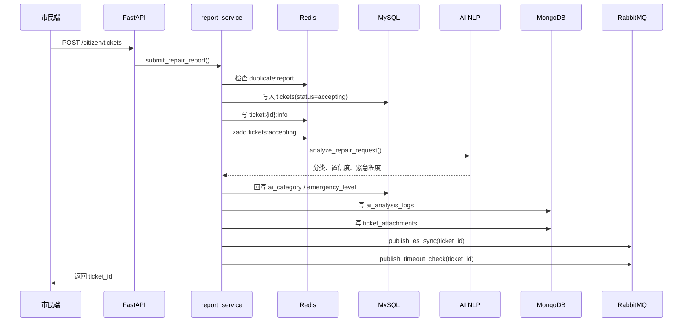
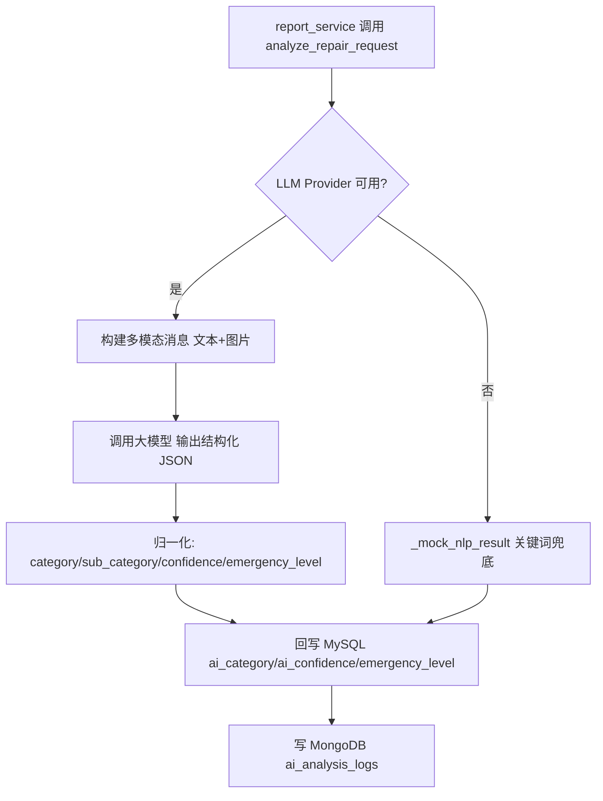
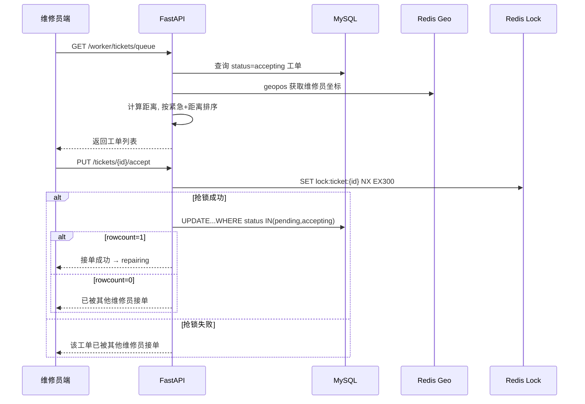
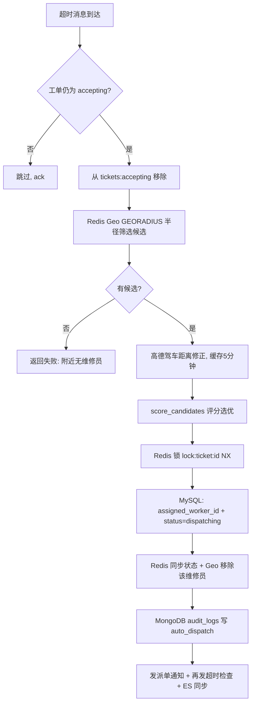
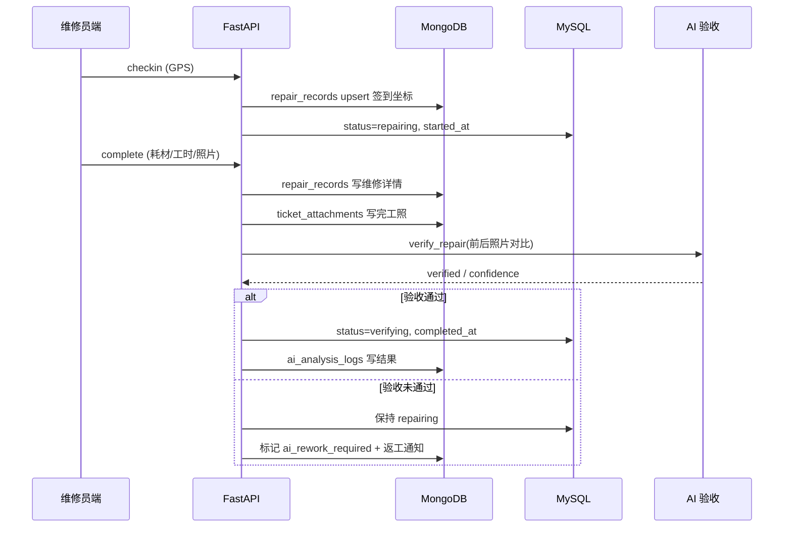
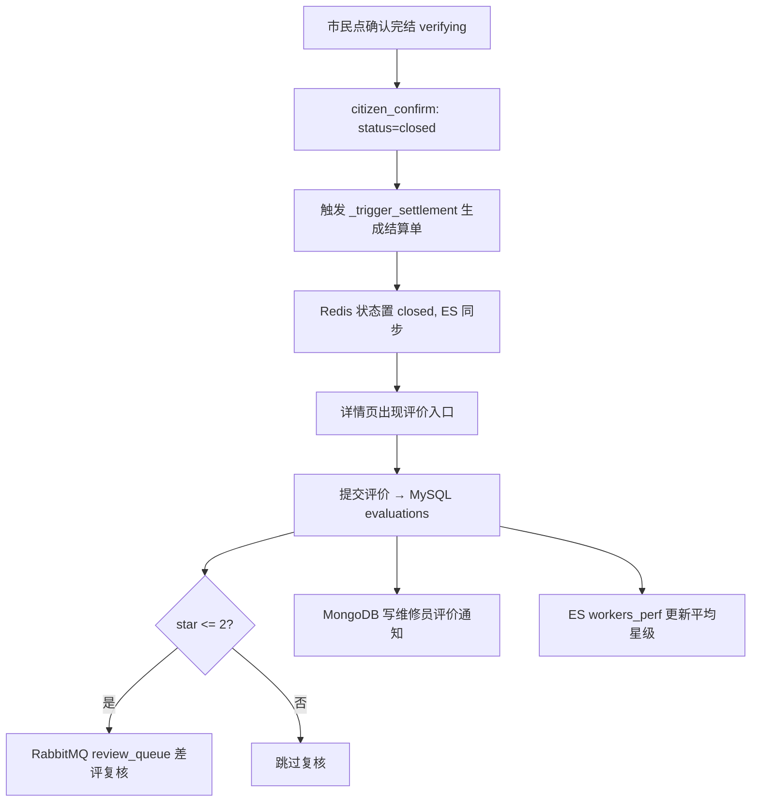
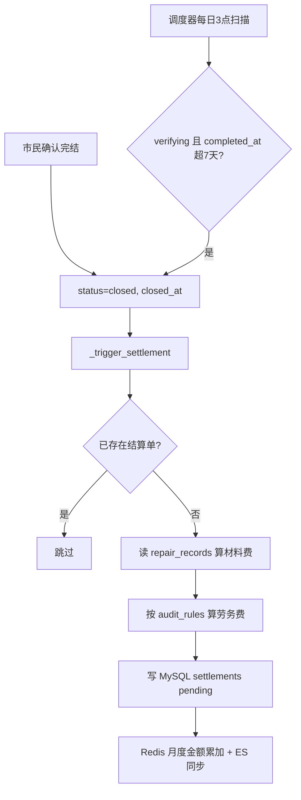
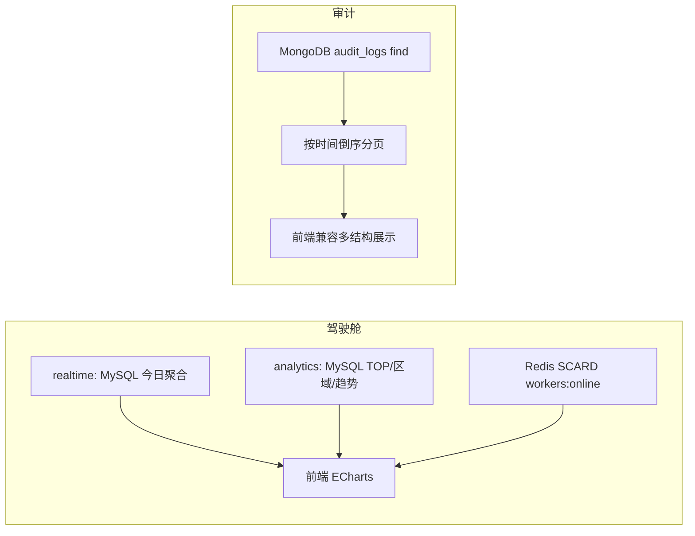

# 城市公共设施智能报修与派单系统 — 项目分析文档

> 本文件仅包含两章：**功能模块分析**与**核心业务流程分析**，内容结合实际项目目录与代码文件整理。

---

# 三、功能模块分析

本项目采用"三端一核三支撑"的业务组织方式：
"三端"分别面向市民、维修员和管理员；"一核"是工单生命周期与派单维修闭环；"三支撑"是 AI 智能能力、RabbitMQ 异步消息处理、MySQL + Redis + MongoDB + Elasticsearch 四库协同存储与搜索。

从实际代码结构看，后端以 FastAPI 按角色拆分 API 路由，统一在 `backend/app/api/v1/router.py` 中汇总：

- 市民端：`backend/app/api/v1/citizen`
- 维修员端：`backend/app/api/v1/worker`
- 管理员端：`backend/app/api/v1/admin`
- 通用认证与上传：`backend/app/api/v1/auth.py`、`backend/app/api/v1/upload.py`

前端也按三端独立工程组织：

- 市民端：`frontend/citizen-app`
- 维修员端：`frontend/worker-h5`
- 管理后台：`frontend/admin-pc`

## 3.1 "三端一核三支撑"总体模块划分

| 分类 | 模块 | 前端入口 | 后端接口/服务 | 核心数据 |
|---|---|---|---|---|
| 市民端 | 登录注册、报修提交、进度查询、确认完结、评价 | `citizen-app/src/views` | `citizen/tickets.py`、`citizen/evaluations.py` | users、tickets、evaluations、ticket_attachments |
| 维修员端 | 接单大厅、位置上报、工单详情、到场签到、完工提交、通知、绩效 | `worker-h5/src/views` | `worker/tickets.py`、`worker/notifications.py`、`worker/performance.py` | tickets、workers、repair_records、notifications、settlements |
| 管理员端 | 数据驾驶舱、GIS 调度、工单检索、人员管理、设施管理、结算审核、审计日志、系统配置 | `admin-pc/src/views` | `admin` 目录下各模块 | tickets、workers、facilities、settlements、audit_logs |
| 一核 | 工单生命周期与派单维修流程 | 三端共同参与 | `report_service.py`、`dispatch_service.py`、`repair_service.py` | Ticket 状态流转 |
| 三支撑-AI | 报修解析、派单评分、维修验收 | 报修页、详情页、完工页 | `services/ai` | ai_analysis_logs |
| 三支撑-MQ | 超时派单、差评复核、ES 同步 | 后台任务 | `rabbitmq_service.py`、`main.py` | dispatch、dispatch_timeout、review_queue、es_sync |
| 三支撑-四库 | 核心事务、缓存与 Geo、文档、检索聚合 | 各模块共用 | `config`、`models` | MySQL、Redis、MongoDB、Elasticsearch |

---

## 3.2 市民端功能模块

市民端主要承担"报修入口"和"闭环确认评价"的职责。前端路由定义在 `frontend/citizen-app/src/router/index.js`，包括登录、注册、报修首页、工单详情、我的工单、服务评价等页面。

### 3.2.1 用户认证模块

市民端认证接口封装在 `frontend/citizen-app/src/api/index.js`，对应后端统一认证接口 `backend/app/api/v1/auth.py`。

主要能力包括：

- 用户名密码登录：`POST /api/v1/auth/login`
- 发送短信验证码：`POST /api/v1/auth/send-sms-code`
- 短信验证码登录：`POST /api/v1/auth/sms-login`
- 用户注册：`POST /api/v1/auth/register`

后端认证逻辑使用 `users` 表保存账号信息，对应模型为 `backend/app/models/mysql/user.py`。登录成功后返回 JWT，并由前端保存到本地存储，路由守卫根据 token 判断是否允许进入报修页面。

需要注意的是，README 和 PRD 中曾提到微信登录、短信登录等方案，当前代码实际提供的是"用户名密码 + 短信验证码"两类登录能力。

### 3.2.2 报修提交模块

市民报修页面位于 `frontend/citizen-app/src/views/home/index.vue`，页面支持：

- 选择设施类型
- 输入故障描述
- 地图选点 / GPS 定位
- 设置紧急程度
- 上传现场照片
- 提交报修

前端调用 `createTicket`，对应后端接口 `POST /api/v1/citizen/tickets`。

后端实际业务由 `submit_repair_report`（`backend/app/services/citizen/report_service.py`）编排，核心动作包括：

1. Redis 防重复提交检查；
2. 生成工单号；
3. 高德逆地理编码补全地址和行政区；
4. MySQL 写入 `tickets` 主表；
5. Redis 写入 `ticket:{ticket_id}:info` 热状态缓存；
6. Redis ZSet 写入 `tickets:accepting` 接单大厅；
7. 调用 AI 解析报修内容；
8. MongoDB 写入 `ai_analysis_logs` 和 `ticket_attachments`；
9. RabbitMQ 发布 ES 同步消息；
10. RabbitMQ 发布 10 分钟超时检查消息。

这里体现了系统的"主链路同步落库、增强能力异步容错"的设计：MySQL 工单创建是主流程关键点，AI、MongoDB、ES、MQ 失败不会阻断市民获得工单受理回执。

### 3.2.3 工单进度查询模块

市民端工单详情页面为 `frontend/citizen-app/src/views/ticket-detail/index.vue`，前端调用 `GET /api/v1/citizen/tickets/{ticket_id}`。

后端接口位于 `backend/app/api/v1/citizen/tickets.py`，复用三端统一详情服务 `get_ticket_detail`（`backend/app/services/ticket_detail_service.py`）。

该详情服务聚合多个数据源：

| 数据源 | 作用 |
|---|---|
| MySQL `tickets` | 工单主状态、地址、报修人、维修员、时间节点 |
| MySQL `users` | 报修人昵称、电话、头像 |
| MySQL `workers` | 维修员姓名、星级、历史工单 |
| MongoDB `ticket_attachments` | 报修照片、完工照片 |
| MongoDB `repair_records` | 签到、耗材、工时、维修备注 |
| MongoDB `ai_analysis_logs` | AI 分类、AI 验收 |
| MySQL `settlements` | 费用结算信息 |
| MySQL `evaluations` | 市民评价信息 |

前端展示为时间轴、报修信息、维修员信息、报修照片、完工照片、AI 验收结果、结算信息和评价入口。

### 3.2.4 确认完结模块

当工单状态为 `verifying` 时，市民端详情页展示"确认完结"按钮，调用：

- 前端：`closeTicket`
- 后端：`PUT /api/v1/citizen/tickets/{ticket_id}/close`

后端会校验：

1. 工单存在；
2. 当前用户是报修人本人；
3. 工单状态必须为 `verifying`。

校验通过后调用 `citizen_confirm`（`backend/app/services/worker/repair_service.py`），将工单状态改为 `closed`，写入 `closed_at`，同步 Redis 状态，并触发结算单生成。

### 3.2.5 服务评价模块

评价页面位于 `frontend/citizen-app/src/views/evaluation/index.vue`，支持星级、快捷标签和文字评价。

后端接口为 `POST /api/v1/citizen/evaluations`，业务逻辑在 `submit_evaluation`（`backend/app/services/citizen/evaluation_service.py`）。

评价模块主要实现：

- MySQL `evaluations` 写入评价记录；
- `ticket_id` 唯一索引防止重复评价；
- 2 星及以下差评发布 RabbitMQ 复核消息；
- MongoDB 写入维修员评价通知；
- Elasticsearch 更新维修员绩效索引。

对应模型为 `backend/app/models/mysql/evaluation.py`。

---

## 3.3 维修员端功能模块

维修员端聚焦"接单、到场、维修、完工、绩效和通知"。前端路由定义在 `frontend/worker-h5/src/router/index.js`。

### 3.3.1 维修员登录与位置初始化

维修员使用统一登录接口 `POST /api/v1/auth/login`。当登录用户角色为 `worker` 时，后端会：

- 将维修员加入 Redis Set：`workers:online`；
- 根据 GPS、IP 定位或默认长沙中心初始化位置；
- 写入 Redis Geo：`workers:geo`。

这为后续接单大厅距离计算和自动派单提供基础数据。维修员前端登录调用位于 `frontend/worker-h5/src/api/index.js`。

### 3.3.2 接单大厅模块

接单大厅页面为 `frontend/worker-h5/src/views/queue/index.vue`，调用：

- `GET /api/v1/worker/tickets/queue`
- `PUT /api/v1/worker/tickets/{ticket_id}/accept`

后端接口位于 `backend/app/api/v1/worker/tickets.py`。

接单大厅查询逻辑：

1. MySQL 查询 `status = accepting` 的工单；
2. 从 Redis Geo `workers:geo` 获取当前维修员坐标；
3. 使用 Redis GEODIST 或 Haversine 计算距离；
4. 按紧急程度和距离排序；
5. 返回前端展示。

接单操作中，后端使用 Redis 分布式锁 `lock:ticket:{ticket_id}` 防止多个维修员同时抢单。成功后更新：

- MySQL `tickets.assigned_worker_id`
- MySQL `tickets.status = repairing`
- MySQL `accepted_at`
- Redis `ticket:{ticket_id}:info`
- Redis `tickets:accepting`
- Redis `worker:{worker_id}:daily_order`
- RabbitMQ ES 同步消息

> 并发安全说明：接单写入已升级为数据库级原子更新 `UPDATE ... WHERE status IN ('pending','accepting')`，配合 Redis 锁形成双重兜底，防止锁 TTL 过期场景下的并发双接。

### 3.3.3 维修员位置上报模块

维修员端通过 `updateLocation` 调用 `PUT /api/v1/worker/location`。

后端在 `backend/app/api/v1/worker/tickets.py` 中将维修员当前位置写入 Redis Geo：

```text
workers:geo -> worker_id -> lng/lat
```

该数据服务于：

- 接单大厅距离排序；
- 自动派单候选人筛选；
- 管理端 GIS 调度台展示在线维修员位置。

### 3.3.4 到场签到模块

维修员工单详情页为 `frontend/worker-h5/src/views/ticket-detail/index.vue`，页面中提供到场签到操作。

前端调用 `checkinTicket`，后端接口为 `PUT /api/v1/worker/tickets/{ticket_id}/checkin`。

业务逻辑在 `worker_checkin`，主要完成：

1. 校验工单存在；
2. 校验当前维修员是被指派维修员；
3. 校验状态为 `dispatching` 或 `repairing`；
4. MongoDB `repair_records` upsert 写入 GPS 签到坐标；
5. MySQL 更新 `status = repairing`、`started_at`；
6. Redis 更新工单缓存；
7. RabbitMQ 发布 ES 同步。

### 3.3.5 维修完工模块

完工页面为 `frontend/worker-h5/src/views/complete/index.vue`，支持：

- 上传完工照片；
- 填写耗材；
- 填写维修工时；
- 填写维修备注；
- 提交完工并显示 AI 验收结果。

前端调用 `completeTicket`，后端接口为 `PUT /api/v1/worker/tickets/{ticket_id}/complete`。

业务逻辑由 `worker_complete` 实现：

1. 校验工单归属和状态；
2. MongoDB `repair_records` 写入耗材、工时、备注、完工照片；
3. MongoDB `ticket_attachments` 写入完工照片元数据；
4. 获取报修照片；
5. 调用 AI 验收 `verify_repair`；
6. MongoDB `ai_analysis_logs` 写入验收结果；
7. 若验收通过，MySQL 工单状态变为 `verifying`；
8. 若验收失败，状态保持 `repairing`，并向维修员写入返工通知；
9. Redis 更新工单状态；
10. Redis Geo 恢复维修员可接单状态；
11. RabbitMQ 发布 ES 同步。

### 3.3.6 通知模块

维修员通知接口位于 `backend/app/api/v1/worker/notifications.py`，对应前端页面 `frontend/worker-h5/src/views/notifications/index.vue`。

通知数据存储在 MongoDB `notifications` 集合，模型定义见 `backend/app/models/mongo/notification.py`。

通知来源包括：

- 自动派单通知；
- 管理员强制指派通知；
- AI 验收失败返工通知；
- 市民评价通知。

### 3.3.7 绩效模块

维修员绩效接口为 `GET /api/v1/worker/performance`，前端封装在 `frontend/worker-h5/src/api/index.js`。

当前实现的数据来源包括：

- MySQL `tickets`：今日工单、本月工单；
- MySQL `evaluations`：平均星级；
- MySQL `settlements`：历史结算金额；
- MySQL `workers` / `users`：维修员姓名。

PRD 中提到 Redis 计数器和 ES 绩效索引，代码中部分场景使用 Redis `worker:{id}:daily_order`，但绩效接口当前主要走 MySQL 实时统计。

---

## 3.4 管理员端功能模块

管理员端是"指挥、监管、审计、配置"的入口。根布局和菜单位于 `frontend/admin-pc/src/App.vue`，包含：数据驾驶舱、GIS 调度台、工单检索、人员管理、设施档案、结算审计、操作审计、系统配置。

### 3.4.1 数据驾驶舱模块

驾驶舱页面为 `frontend/admin-pc/src/views/dashboard/index.vue`，调用：

- `GET /api/v1/admin/dashboard/realtime`
- `GET /api/v1/admin/dashboard/analytics`

后端接口位于 `backend/app/api/v1/admin/dashboard.py`。当前代码实际使用 MySQL 聚合和 Redis 在线人数：

| 指标 | 数据来源 |
|---|---|
| 今日新增 | MySQL `tickets.created_at >= CURDATE()` |
| 待派发 | MySQL `status in pending/dispatching` |
| 维修中 | MySQL `status = repairing` |
| 验收中 | MySQL `status = verifying` |
| 今日完结 | MySQL `closed_at >= CURDATE()` |
| 在线维修员 | Redis `workers:online` |
| 高频故障 | MySQL `GROUP BY facility_type` |
| 片区分布 | MySQL `GROUP BY district` |
| 近 6 个月趋势 | MySQL `DATE_FORMAT(created_at)` 分组 |

PRD 中描述的 ES Aggregation 在当前驾驶舱实现中并未作为主数据源，属于设计与实现存在差异的点。

### 3.4.2 GIS 调度台模块

GIS 调度台页面为 `frontend/admin-pc/src/views/dispatch/index.vue`，主要展示：高德地图设施一张图、设施点位聚合、在线维修员位置、接单池中的待指派工单、管理员强制指派。

对应接口包括：

- `GET /api/v1/admin/facilities`
- `GET /api/v1/admin/workers`
- `GET /api/v1/admin/tickets/search`
- `POST /api/v1/admin/tickets/{ticket_id}/dispatch`

强制指派时，后端会：

1. 释放原 Redis 派单锁；
2. 设置新的 `lock:ticket:{ticket_id}`；
3. 更新 MySQL 工单的 `assigned_worker_id` 和 `status = dispatching`；
4. MongoDB 写入 `audit_logs`；
5. Redis 同步工单缓存；
6. RabbitMQ 发布 ES 同步消息。

### 3.4.3 工单检索模块

管理后台工单检索接口为 `GET /api/v1/admin/tickets/search`。代码实现为"ES 优先 + MySQL 降级"：

- 如果 ES 可用，使用 `multi_match` 检索 `description` 和 `address`；
- 支持按状态、设施类型、行政区、创建时间过滤；
- ES 返回后，再与 MySQL 交叉校验，过滤 MySQL 中已删除的工单；
- 若 ES 失败，则使用 MySQL `like` 和条件查询降级。

这体现了"搜索系统最终一致、核心数据以 MySQL 为准"的设计。

### 3.4.4 设施管理模块

设施管理接口为 `GET /api/v1/admin/facilities`。设施模型为 `backend/app/models/mysql/facility.py`。当前实现基于 MySQL 查询设施基础档案，字段包括 `facility_code`、`type`、`location_lng`、`location_lat`、`address`、`district`、`status`、`total_faults`。

PRD 中提到 ES facilities_index 支持全文检索和 GeoPoint 空间查询，但当前代码中的设施列表接口主要是 MySQL 查询。

### 3.4.5 维修员管理模块

维修员管理接口位于 `backend/app/api/v1/admin/workers.py`，主要提供：查询维修员列表、按片区/姓名/技能筛选、查询技能标签、更新技能/日单量上限/夜班状态、创建新维修员账号和档案。

数据来自：MySQL `workers`、MySQL `users`、Redis `workers:online`、Redis `worker:{id}:daily_order`、Redis Geo `workers:geo`。维修员模型为 `backend/app/models/mysql/worker.py`。

### 3.4.6 结算管理模块

结算接口位于 `backend/app/api/v1/admin/settlements.py`，支持查询结算单列表、按审核状态/工单号/维修员/日期过滤、结算审核通过或驳回。结算单模型为 `backend/app/models/mysql/settlement.py`。

结算生成并不是管理员手工创建，而是在工单关闭时由 `_trigger_settlement` 自动触发。其费用计算来源包括：

- MongoDB `repair_records.materials`：材料费；
- MongoDB `repair_records.labor_hours`：工时；
- MySQL `audit_rules`：不同设施类型的基础价格、加班系数、夜间补贴；
- MySQL `tickets.emergency_level`：紧急工单加价系数。

### 3.4.7 审计日志模块

审计日志接口为 `GET /api/v1/admin/audit-logs`，前端页面为 `frontend/admin-pc/src/views/audit/index.vue`。审计日志存储在 MongoDB `audit_logs`，模型为 `backend/app/models/mongo/audit_log.py`。

当前系统会在以下场景写入审计：系统自动派单、管理员强制指派、其他后台配置或操作预留。

审计页面对不同结构的 MongoDB 文档做了兼容展示，说明当前审计日志写入结构并不完全统一，例如有的使用 `target`，有的使用 `target_type/target_id/detail`。

### 3.4.8 文件上传与图片存储模块

图片上传接口位于 `backend/app/api/v1/upload.py`，路径为 `POST /api/v1/utils/upload-image`。

前端市民端和维修员端均通过上传工具将图片提交到后端，再由后端转发至 OSS。后端调用 `upload_file_to_oss`，返回公网 URL。

图片 URL 后续会写入 MongoDB：

- 报修照片：`ticket_attachments.stage = report`
- 完工照片：`ticket_attachments.stage = completion`
- 维修记录中的 `after_photos`

需要注意的是，MongoDB Pydantic 模型 `ticket_attachment.py` 中定义的是 `type/image_url` 结构，而实际服务代码写入的是 `stage/image_urls` 结构，存在模型定义与实际写入不完全一致的问题。

---

## 3.5 一核：工单生命周期与派单维修流程

系统核心是 `Ticket` 工单主表，对应模型 `backend/app/models/mysql/ticket.py`。当前状态枚举包括：

```text
pending / accepting / dispatching / repairing / verifying / closed / cancelled
```

从实际代码看，主要状态流转如下：



> 说明：市民提交后服务层将工单状态直接设为 `accepting`，表示进入接单大厅；提交接口返回的 `status` 字段此前写为 `pending`，已修正为 `accepting`，保持与入库语义一致。

---

## 3.6 三支撑能力分析

### 3.6.1 AI 智能能力支撑

AI 模块集中在 `backend/app/services/ai`，主要包括：

| AI 能力 | 文件 | 作用 |
|---|---|---|
| 报修 NLP 解析 | `nlp_service.py` | 从文字和图片中提取设施类型、故障类别、紧急程度、维修建议 |
| 派单评分 | `dispatch_score_service.py` | 对候选维修员进行评分并选择最优维修员 |
| AI 验收 | `verify_service.py` | 对比维修前后照片与描述，判断是否通过验收 |
| LLM Provider | `provider.py` | 封装大模型调用能力 |

实际调用点：报修提交（`submit_repair_report`）、自动派单（`execute_dispatch`）、完工验收（`worker_complete`）。AI 结果统一写入 MongoDB `ai_analysis_logs`，用于后续详情展示和审计追踪。

### 3.6.2 RabbitMQ 异步能力支撑

RabbitMQ 服务封装在 `backend/app/services/mq/rabbitmq_service.py`，核心队列包括：

| 队列 | 作用 |
|---|---|
| `dispatch` | 派单任务 |
| `dispatch_timeout.delay` | 派单超时延迟队列 |
| `dispatch_timeout` | 超时检查消费队列 |
| `review_queue` | 差评复核队列 |
| `es_sync` | ES 同步队列 |
| `es_sync.delay` | ES 同步重试延迟队列 |
| `es_sync.dlq` | ES 同步死信队列 |

后台消费者在 `backend/app/main.py` 的 lifespan 中启动：派单消费者 `_start_dispatch_consumer`、ES 同步消费者 `_start_es_sync_consumer`、自动完结调度器 `_start_auto_close_scheduler`。

RabbitMQ 在该项目中主要解决两个问题：报修/派单/搜索同步之间的解耦；超时、重试、死信等可靠性场景。

### 3.6.3 四库数据存储与搜索支撑

系统实际采用四库分工：

| 存储 | 实际作用 |
|---|---|
| MySQL | 用户、工单、维修员、设施、评价、结算等强事务结构化数据 |
| Redis | 工单缓存、接单大厅 ZSet、在线维修员 Set、Geo 位置、分布式锁、计数器 |
| MongoDB | AI 分析日志、维修记录、附件元数据、通知、审计日志 |
| Elasticsearch | 工单检索、ES 同步、维修员绩效索引更新 |

四库并不是简单堆叠，而是在具体流程中分层协作：

- 报修：MySQL 建主单，MongoDB 存附件和 AI，Redis 存热状态，ES 异步索引；
- 派单：Redis Geo 筛选，MySQL 存工单归属，MongoDB 存审计，RabbitMQ 同步 ES；
- 维修：MongoDB 存维修详情，MySQL 控制状态流转，Redis 同步状态；
- 统计：管理后台当前以 MySQL 聚合为主，Redis 补充在线人数。

---

# 五、核心业务流程分析

## 5.1 市民报修流程

**触发角色**：市民。

**输入数据**（市民端 `home/index.vue` 提交）：

| 字段 | 含义 |
|---|---|
| `facility_type` | 设施类型，如路灯、井盖、护栏 |
| `description` | 故障描述 |
| `location_lng` / `location_lat` | 故障坐标 |
| `address` | 地址文本 |
| `image_urls` | 报修图片 OSS URL |
| `emergency_level` | 紧急程度 |

**涉及接口或服务**：

- 前端 API：`createTicket`
- 后端接口：`POST /api/v1/citizen/tickets`
- 业务服务：`submit_repair_report`

**处理步骤**：



**涉及数据表或集合**：

| 数据源 | 表/集合 | 用途 |
|---|---|---|
| MySQL | `tickets` | 工单主记录 |
| Redis | `duplicate:report:{hash}` | 防重复提交锁，5 分钟 TTL |
| Redis | `ticket:{ticket_id}:info` | 工单热状态，14 天 TTL |
| Redis | `tickets:accepting` | 接单大厅候选工单 ZSet |
| MongoDB | `ai_analysis_logs` | AI 报修解析结果（workflow=nlp_parse） |
| MongoDB | `ticket_attachments` | 报修图片元数据（stage=report） |
| RabbitMQ | `es_sync` | 触发 ES 索引同步 |
| RabbitMQ | `dispatch_timeout.delay` | 10 分钟超时检查 |

**输出结果**：返回 `ticket_id`、`status`（accepting）、`ai_category`、受理回执消息。工单进入接单大厅。

**异常情况**：

| 异常 | 处理方式 |
|---|---|
| 5 分钟内重复提交 | 命中 Redis 哈希锁，返回已有工单，`is_duplicate=true` |
| 逆地理编码失败 | 降级用 `_infer_district` 从地址串推断行政区 |
| AI 解析失败 | 捕获异常，`ai_category` 兜底为"其他设施" |
| MongoDB / ES / MQ 失败 | 各自 try-except 容错，仅记日志，工单已落库 |

唯一同步阻断点是 MySQL 写入；其余均为异步容错。

---

## 5.2 AI 辅助报修分类流程

**触发角色**：系统（在市民报修主流程内被动触发，非独立接口）。

**输入数据**：故障文字描述 `description`、报修图片 `image_urls`、坐标 `lng/lat`。

**涉及接口或服务**：

- 入口：`analyze_repair_request`
- LLM 封装：`provider.py`
- 提示词：`prompts.py`
- 结果归一化：`_normalize_nlp_outputs`

**处理步骤**：



**涉及数据表或集合**：

| 数据源 | 表/集合 | 用途 |
|---|---|---|
| MySQL | `tickets.ai_category` / `ai_confidence` | 回写分类结果 |
| MongoDB | `ai_analysis_logs` | 完整 AI 解析输入输出留痕 |

**输出结果**：故障分类、子类、置信度、紧急程度、维修建议等结构化字段；回写工单并在前端详情页"AI 智能诊断"面板展示。

**异常情况**：LLM 不可用或返回非法 JSON 时，降级为 `_mock_nlp_result`，保证报修流程不中断。若 `facility_type` 为 `other`，会用 AI 分类覆盖。

---

## 5.3 接单大厅流程

**触发角色**：维修员。

**输入数据**：维修员身份（JWT）、Redis Geo 中的维修员实时坐标。

**涉及接口或服务**：

- 前端页面：`worker-h5/.../queue/index.vue`
- 查询接口：`GET /api/v1/worker/tickets/queue`
- 接单接口：`PUT /api/v1/worker/tickets/{id}/accept`
- 位置上报：`PUT /api/v1/worker/location`

**处理步骤**：



**涉及数据表或集合**：

| 数据源 | 表/集合 | 用途 |
|---|---|---|
| MySQL | `tickets` | 查询候选 + 原子接单更新 |
| Redis Geo | `workers:geo` | 维修员坐标，计算距离 |
| Redis Lock | `lock:ticket:{id}` | 防并发双接 |
| Redis | `tickets:accepting` | 接单后移除 |
| Redis Counter | `worker:{id}:daily_order` | 当日接单计数 +1 |

**输出结果**：工单状态 `accepting → repairing`，`assigned_worker_id` 绑定该维修员，前端跳转工单详情。

**异常情况**：

| 异常 | 处理 |
|---|---|
| 并发抢单 | Redis 锁 + 数据库 `WHERE status IN(...)` 双重兜底 |
| 同人重试 | 锁持有者一致时幂等返回成功 |
| 工单已被处理 | `rowcount==0` 抛"已被其他维修员接单" |
| 维修员无坐标 | 距离降级为 0，不影响接单 |

---

## 5.4 自动派单流程

**触发角色**：系统（RabbitMQ 超时消费者，10 分钟无人抢单时触发）；管理员强制指派为补充路径。

**输入数据**：`ticket_id`、工单坐标与紧急程度、Redis Geo 在岗维修员。

**涉及接口或服务**：

- 超时消费者：`handle_timeout`（`main.py`）
- 派单核心：`execute_dispatch`
- 评分服务：`score_candidates`
- 驾车距离修正：`driving_distance`
- 派单通知：`create_dispatch_notification`

**处理步骤**：



**涉及数据表或集合**：

| 数据源 | 表/集合 | 用途 |
|---|---|---|
| MySQL | `tickets` / `workers` | 工单指派、候选档案 |
| Redis Geo | `workers:geo` | 半径筛选候选 + 指派后移除 |
| Redis Lock | `lock:ticket:{id}` | 派单锁，300s |
| Redis Cache | `amap:driving:{w}:{t}` | 驾车距离缓存 |
| MongoDB | `audit_logs` | 派单审计 |
| MongoDB | `notifications` | 派单通知 |
| RabbitMQ | `es_sync` / `dispatch_timeout` | 同步与二次兜底 |

**输出结果**：工单 `accepting → dispatching`，绑定评分最优维修员，维修员收到派单通知。

**异常情况**：

| 异常 | 处理 |
|---|---|
| 半径内无在岗维修员 | 返回失败，工单仍可被人工指派 |
| 评分服务不可用 | `_simple_score_candidates` 退化为按距离 |
| MySQL 更新失败 | 释放 Redis 锁，返回数据库异常 |
| 驾车距离查询失败 | 降级保持 Redis Geo 直线距离 |

> 实现差异提示：当前 `execute_dispatch` 跳过了硬约束过滤（技能/夜班/日单上限），`_apply_hard_constraints` 系列函数已定义但未在主路径调用，与 PRD"硬约束过滤"描述不一致。

---

## 5.5 维修员维修处理流程

**触发角色**：维修员。

**输入数据**：到场签到坐标 `lng/lat`；完工时的耗材数组、工时、备注、完工照片 URL。

**涉及接口或服务**：

- 签到接口：`PUT /tickets/{id}/checkin` → `worker_checkin`
- 完工接口：`PUT /tickets/{id}/complete` → `worker_complete`
- AI 验收：`verify_repair`
- 完工页面：`worker-h5/.../complete/index.vue`

**处理步骤**：



**涉及数据表或集合**：

| 数据源 | 表/集合 | 用途 |
|---|---|---|
| MongoDB | `repair_records` | 签到 GPS、耗材、工时、备注、完工照 |
| MongoDB | `ticket_attachments` | 完工照片元数据（stage=completion） |
| MongoDB | `ai_analysis_logs` | AI 验收结果（workflow=ai_verify） |
| MongoDB | `notifications` | 返工通知 |
| MySQL | `tickets` | 状态流转、时间戳 |
| Redis Geo | `workers:geo` | 完工后恢复维修员可接单 |

**输出结果**：验收通过：`repairing → verifying`，等待市民确认。验收未通过：保持 `repairing`，维修员收到返工通知。

**异常情况**：

| 异常 | 处理 |
|---|---|
| 非指派维修员操作 | 校验 `assigned_worker_id` 拒绝 |
| 状态不符 | 签到要求 dispatching/repairing；完工要求 repairing |
| AI 验收服务不可用 | 默认通过（`verified=True, confidence=0.75`），保证闭环不卡死 |

---

## 5.6 验收与评价流程

**触发角色**：市民。

**输入数据**：确认完结请求；评价的星级 `star`、标签 `tags`、文字 `comment`。

**涉及接口或服务**：

- 确认完结：`PUT /citizen/tickets/{id}/close` → `citizen_confirm`
- 提交评价：`POST /citizen/evaluations` → `submit_evaluation`
- 评价页面：`citizen-app/.../evaluation/index.vue`

**处理步骤**：



**涉及数据表或集合**：

| 数据源 | 表/集合 | 用途 |
|---|---|---|
| MySQL | `tickets` | 完结状态流转 |
| MySQL | `evaluations` | 评价记录（ticket_id 唯一） |
| MySQL | `settlements` | 完结触发结算 |
| MongoDB | `notifications` | 评价通知维修员 |
| RabbitMQ | `review_queue` | 差评复核 |
| Elasticsearch | `{prefix}_workers_perf` | 维修员绩效星级聚合 |

**输出结果**：工单完结并生成结算单；评价写入并联动维修员绩效；差评进入复核队列。

**异常情况**：

| 异常 | 处理 |
|---|---|
| 非 verifying 状态确认 | 拒绝 |
| 非本人确认 | 拒绝 |
| 重复评价 | `ticket_id` 唯一索引冲突 → 接口抛"已评价" |
| 差评消息/ES/通知失败 | try-except 容错，不影响评价写入 |

---

## 5.7 工单关闭流程

**触发角色**：市民（主动确认）或系统（7 天超时自动完结）。

**输入数据**：`ticket_id`；自动路径无人工输入。

**涉及接口或服务**：

- 市民确认：`citizen_confirm`
- 超时自动完结：`auto_close_expired_tickets`
- 定时调度：`_start_auto_close_scheduler`（每日凌晨 3 点）
- 结算生成：`_trigger_settlement`

**处理步骤**：



**涉及数据表或集合**：

| 数据源 | 表/集合 | 用途 |
|---|---|---|
| MySQL | `tickets` | 完结状态 |
| MySQL | `settlements` | 自动结算单 |
| MySQL | `audit_rules` | 劳务费规则（设施类型/加班/夜间/紧急） |
| MongoDB | `repair_records` | 材料费、工时来源 |
| Redis Counter | `settlement:month:{YYYYMM}` | 月度结算金额 |
| RabbitMQ | `es_sync` | 同步关闭状态 |

**输出结果**：工单 `verifying → closed`，自动生成待审核结算单。

**异常情况**：

| 异常 | 处理 |
|---|---|
| 结算单已存在 | 防重复，跳过 |
| 无维修记录 | 记日志并跳过结算 |
| 无匹配结算规则 | 降级用 `facility_type="other"` 规则，再缺则 base_price=40 |
| 材料字段不规范 | 兼容 qty/quantity、unit_cost/price/cost，转换失败计 0 |

---

## 5.8 后台统计与审计流程

**触发角色**：管理员。

**输入数据**：驾驶舱无参数（实时）或日期范围（聚合）；审计查询的操作人、操作类型、时间范围。

**涉及接口或服务**：

- 实时指标：`GET /admin/dashboard/realtime`
- 聚合统计：`GET /admin/dashboard/analytics`
- 审计查询：`GET /admin/audit-logs`
- 前端：`dashboard/index.vue`、`audit/index.vue`

**处理步骤**：



**涉及数据表或集合**：

| 数据源 | 表/集合 | 用途 |
|---|---|---|
| MySQL | `tickets` | 今日/存量/趋势/故障/区域聚合 |
| MySQL | `evaluations` | 平均好评率 |
| Redis | `workers:online` | 在岗人数 SCARD |
| MongoDB | `audit_logs` | 操作审计查询 |

**输出结果**：实时运营卡片、工单流转看板、月度趋势、高频故障 TOP10、片区分布；审计日志按操作类型可读化展示。

**异常情况**：

| 异常 | 处理 |
|---|---|
| 数据加载失败 | 前端 catch 记日志，看板留空 |
| 审计文档结构不一致 | 前端 `changeSummary` 兼容 A/B/C/D 四种结构 |

> 实现差异提示：PRD 称驾驶舱由"MySQL 实时 + ES Aggregation 双层"驱动，实际 `dashboard.py` 聚合全部走 MySQL，ES 仅用于工单检索与绩效星级，未参与驾驶舱聚合。

---

## 附：代码与设计不一致点汇总

| 序号 | 不一致点 | 位置 |
|---|---|---|
| 1 | 报修接口返回 `status` 曾为 `pending`（已修正为 `accepting`） | `report_service.py` |
| 2 | 自动派单跳过硬约束过滤，`_apply_hard_constraints` 系列未在主路径调用 | `dispatch_service.py` |
| 3 | 驾驶舱聚合全部走 MySQL，PRD 描述的 ES Aggregation 未启用 | `admin/dashboard.py` |
| 4 | 设施列表接口仅 MySQL 查询，PRD 描述的 ES 全文/GeoPoint 检索未启用 | `admin/facilities.py` |
| 5 | `ticket_attachment` 模型定义 `type/image_url`，实际写入 `stage/image_urls` | `models/mongo/ticket_attachment.py` |
| 6 | `audit_logs` 写入结构不统一（target vs target_type/detail），前端做多结构兼容 | `audit_logs` 相关代码 |
| 7 | 维修员绩效接口主要走 MySQL，PRD 强调的 ES 绩效索引仅评价时更新 | `worker/performance.py` |